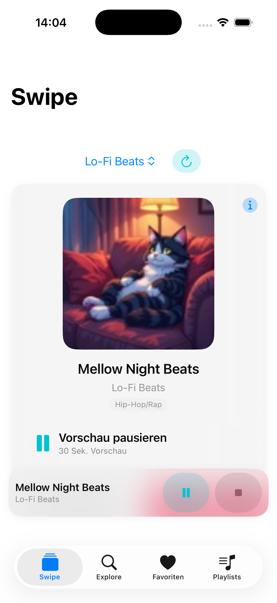
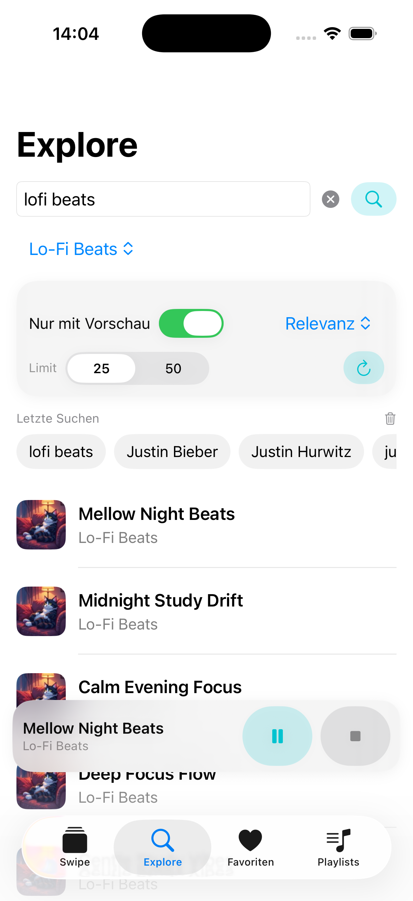
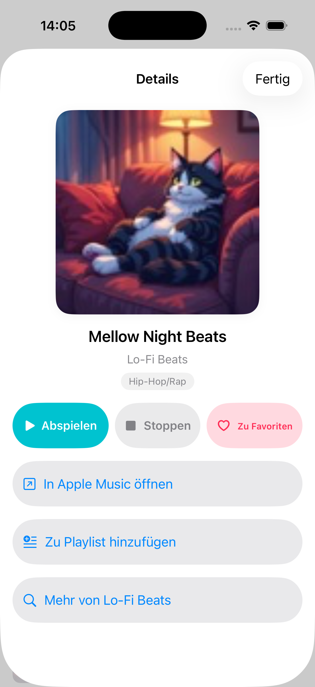
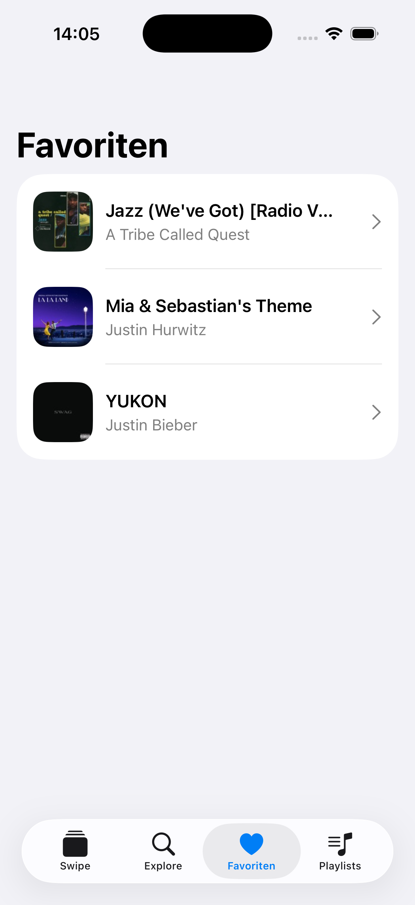
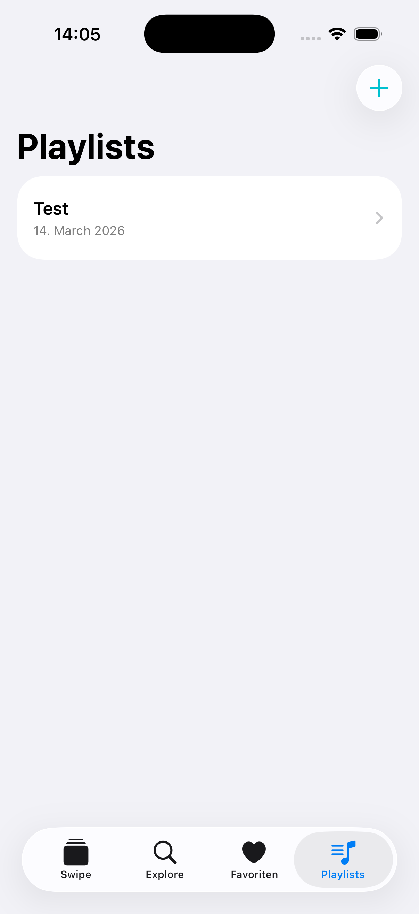
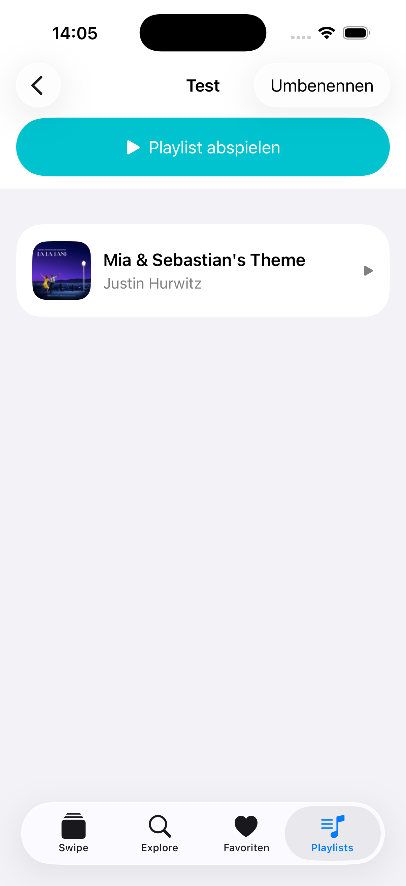

# 🎧 SwipeBeats

## 🇩🇪 Deutsch

SwipeBeats ist eine moderne iOS-App zur schnellen Musik-Discovery über kurze Audio-Previews.  
Die App kombiniert klassische Suche mit einem Swipe-basierten Flow, um neue Songs intuitiv zu entdecken, vorzuhören und zu organisieren.

👉 Fokus: **schnelles Entdecken, direktes Vorhören und einfache Organisation von Musik**

---

## 📱 App Preview

  
  
  

  
  
  

---

## 🚀 Core Features

### 🔍 Explore – Musik entdecken
- Freie Suche nach Künstlern, Songs oder Genres  
- Presets für schnellen Einstieg  
- Filter & Sortierung (z. B. nur Tracks mit Preview)  
- Suchverlauf für schnellen Zugriff  

### 🔄 Swipe Discovery
- Tinder-ähnlicher Flow zum Durchgehen von Tracks  
- Direktes Skippen oder Favorisieren  
- Schneller Zugriff auf Track-Details  

### ▶️ Globaler Audio-Player
- 30-Sekunden-Previews über die gesamte App hinweg  
- Globaler MiniPlayer mit konsistentem Playback-Kontext  
- Nahtloser Wechsel zwischen Screens (Explore, Swipe, Favoriten, Playlists)  

### ❤️ Favoriten
- Tracks liken / entliken  
- Persistente Speicherung über SwiftData  
- Schneller Zugriff auf gespeicherte Songs  

### 📂 Playlists
- Playlists erstellen, umbenennen und löschen  
- Tracks zu Playlists hinzufügen  
- Einzelne Tracks direkt aus Playlists abspielen  

---

## 🧰 Tech Stack

- **Swift & SwiftUI**  
- **MVVM Architektur**  
- **SwiftData**  
- **AVFoundation / AVPlayer**  
- **URLSession**  
- **iTunes Search API**  

---

## ⚠️ Aktueller Scope (MVP)

SwipeBeats ist bewusst als leichtgewichtige Discovery-App umgesetzt:

- Audio basiert auf **30-Sekunden-Previews** (kein Full Streaming)  
- Playlists haben **kein vollständiges Queue-System**  
- „Playlist abspielen“ startet aktuell nur den ersten Track  
- Keine Cloud-Synchronisation oder Accounts  

---

---

## 🇬🇧 English

SwipeBeats is a modern iOS app for fast music discovery using short audio previews.  
It combines traditional search with a swipe-based interaction model to help users quickly explore, preview, and organize music.

👉 Focus: **fast discovery, instant preview, and simple music organization**

---

## 📱 App Preview

  
  
  

  
  
  

---

## 🚀 Core Features

### 🔍 Explore – Discover Music
- Search by artist, song, or genre  
- Presets for quick discovery  
- Filtering & sorting (e.g. only tracks with preview)  
- Recent search history  

### 🔄 Swipe Discovery
- Tinder-like interaction to browse tracks  
- Quickly skip or like tracks  
- Access track details instantly  

### ▶️ Global Audio Player
- 30-second previews across the entire app  
- Global MiniPlayer with consistent playback state  
- Seamless navigation between screens  

### ❤️ Favorites
- Like / unlike tracks  
- Persistent storage via SwiftData  
- Quick access to saved songs  

### 📂 Playlists
- Create, rename, and delete playlists  
- Add tracks to playlists  
- Play individual tracks from playlists  

---

## 🧰 Tech Stack

- **Swift & SwiftUI**  
- **MVVM Architecture**  
- **SwiftData (Persistence)**  
- **AVFoundation / AVPlayer**  
- **URLSession (Networking)**  
- **iTunes Search API**  

---

## ⚠️ Current Scope (MVP)

- Based on **30-second previews** (not full streaming)  
- No full playlist queue system  
- “Play All” starts only the first playable track  
- No cloud sync or accounts  

---

## 👨‍💻 Author

Minh Khoi Ha  
Junior iOS Developer
