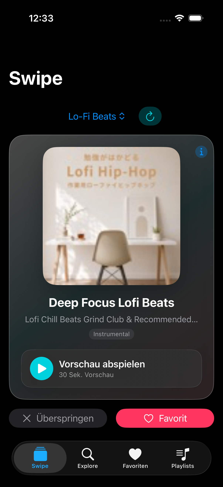
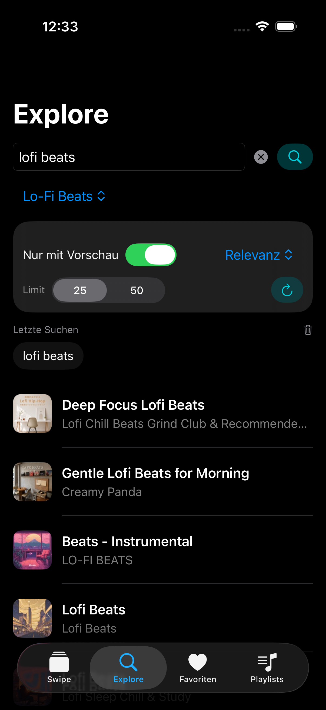
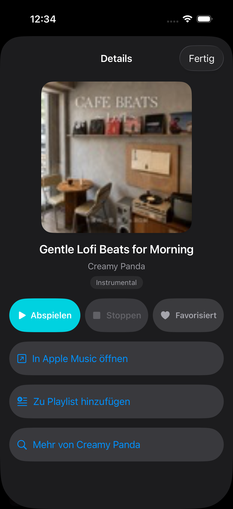
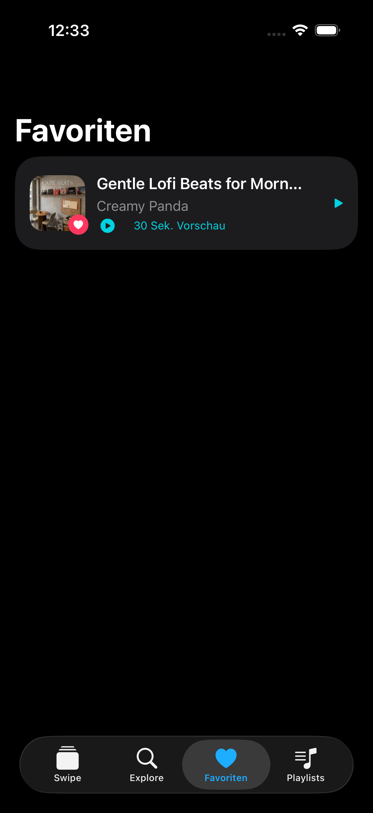
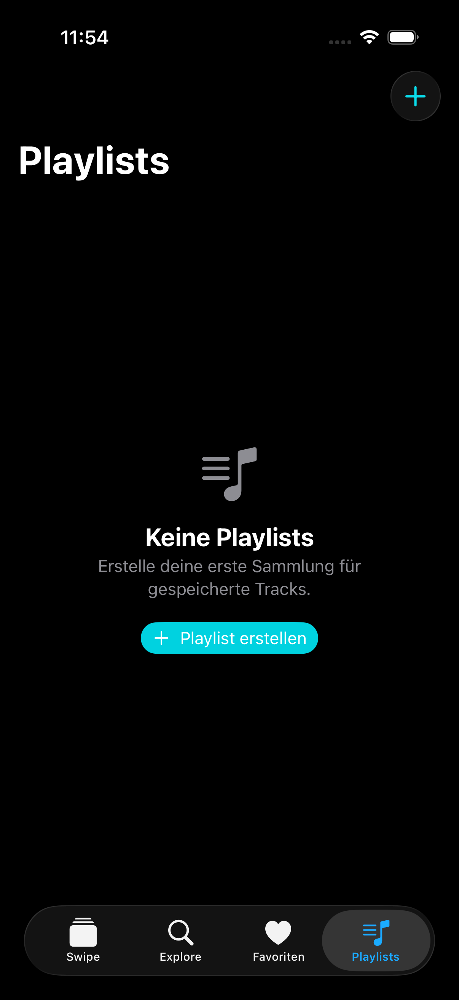
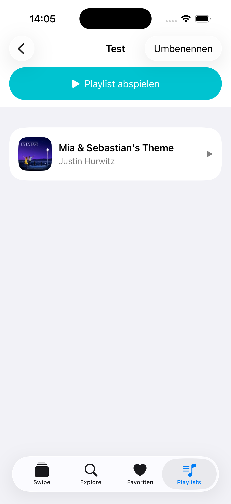

# 🎧 SwipeBeats

## 🇩🇪 Deutsch

SwipeBeats ist eine moderne iOS-App zur schnellen Musik-Discovery über kurze Audio-Previews.  
Die App kombiniert klassische Suche mit einem Swipe-basierten Flow, um neue Songs intuitiv zu entdecken, vorzuhören und zu organisieren.

👉 Fokus: **schnelles Entdecken, direktes Vorhören und einfache Organisation von Musik**

---

## 🧭 Portfolio Snapshot

SwipeBeats zeigt einen kompakten, realistischen iOS-MVP mit mehreren zusammenhängenden Produktbereichen:

- **Discovery Flow:** Suchen, filtern, sortieren und per Swipe neue Tracks entdecken
- **Audio Playback:** globaler Preview-Player mit MiniPlayer und Playlist-Queue
- **Persistenz:** Favoriten und Playlists über SwiftData
- **UI States:** klare Loading-, Empty- und Error-Zustände
- **Testbarkeit:** ViewModel- und Service-Tests für zentrale Nutzerflows

---

## 📱 App Preview

<p align="center">
  
  
  
</p>

<p align="center">
  
  
  
</p>

---

## 🚀 Core Features

### 🔍 Explore – Musik entdecken
- Freie Suche nach Künstlern, Songs oder Genres  
- Presets für schnellen Einstieg  
- Filter & Sortierung (z. B. nur Tracks mit Preview)  
- Suchverlauf für schnellen Zugriff
- Klare Empty- und Error-States bei fehlenden Ergebnissen oder Netzwerkproblemen

### 🔄 Swipe Discovery
- Tinder-ähnlicher Flow zum Durchgehen von Tracks  
- Direktes Skippen oder Favorisieren  
- Schneller Zugriff auf Track-Details
- Reload- und Genre-Wechsel direkt aus Loading-, Empty- und Error-Zuständen

### ▶️ Globaler Audio-Player
- 30-Sekunden-Previews über die gesamte App hinweg  
- Globaler MiniPlayer mit konsistentem Playback-Kontext  
- Nahtloser Wechsel zwischen Screens (Explore, Swipe, Favoriten, Playlists)
- Nächster-Track-Steuerung für Playlist-Queues

### ❤️ Favoriten
- Tracks liken / entliken  
- Persistente Speicherung über SwiftData  
- Schneller Zugriff auf gespeicherte Songs
- Preview direkt aus Favoriten starten

### 📂 Playlists
- Playlists erstellen, umbenennen und löschen  
- Tracks zu Playlists hinzufügen  
- Einzelne Tracks direkt aus Playlists abspielen
- Übersicht mit Track-Anzahl und klaren Zuständen für leere Playlists
- Playlist-Queue mit automatischem Wechsel zum nächsten spielbaren Track

---

## 🧰 Tech Stack

- **Swift & SwiftUI**  
- **MVVM Architektur**  
- **SwiftData**  
- **AVFoundation / AVPlayer**  
- **URLSession**  
- **iTunes Search API**  

---

## 🧪 Qualität & Tests

Aktuell abgesichert:

- Explore filtert Tracks ohne Preview korrekt
- Explore sortiert Tracks alphabetisch
- Explore zeigt einen spezifischen Netzwerkfehler
- Swipe springt nach Skip zum nächsten Track
- Swipe zeigt nach dem letzten Track einen Empty-State
- Audio-Queue setzt `hasNextTrack` und `nowPlayingTrack` korrekt

Verifikation:

```bash
DEVELOPER_DIR=/Applications/Xcode.app/Contents/Developer \
xcodebuild build-for-testing \
  -project SwipeBeats/SwipeBeats.xcodeproj \
  -scheme SwipeBeats \
  -destination 'generic/platform=iOS Simulator'
```

Hinweis: Der vollständige Simulator-Testlauf kann lokal beim Start des Simulators hängen. Die Test-Targets kompilieren mit `build-for-testing` erfolgreich.

---

## 🧩 Case Study

### Ziel
Eine kleine, verständliche Musik-Discovery-App bauen, die als Portfolio-Projekt mehrere iOS-Basics realistisch kombiniert: API, State Management, Persistenz, Audio und Navigation.

### Produktentscheidung
Der MVP bleibt bewusst fokussiert. SwipeBeats streamt keine vollständigen Songs, sondern nutzt die iTunes Search API und deren 30-Sekunden-Previews. Dadurch bleibt die App technisch schlank und trotzdem direkt nutzbar.

### Technische Umsetzung
- SwiftUI Views bleiben möglichst leichtgewichtig
- State und Suchlogik liegen in ViewModels
- SwiftData speichert Favoriten und Playlists lokal
- `AudioPlayerService` hält den globalen Playback-Kontext
- Playlist-Playback nutzt eine einfache Queue statt eines größeren Player-Frameworks

### Gelöste MVP-Lücken
- Playlist-Playback spielt nicht mehr nur den ersten Track, sondern erzeugt eine Queue
- Der MiniPlayer kann zum nächsten Track springen
- Favoriten können direkt previewed werden
- Empty- und Error-States sind konsistenter und nutzerfreundlicher
- Kritische ViewModel- und Audio-Flows sind testbar abgesichert

---

## ⚠️ Aktueller Scope (MVP)

SwipeBeats ist bewusst als leichtgewichtige Discovery-App umgesetzt:

- Audio basiert auf **30-Sekunden-Previews** (kein Full Streaming)  
- Playlists unterstützen eine einfache Preview-Queue
- „Playlist abspielen“ startet alle spielbaren Tracks nacheinander
- Keine Cloud-Synchronisation oder Accounts  

---

## 🇬🇧 English

SwipeBeats is a modern iOS app for fast music discovery using short audio previews.  
It combines traditional search with a swipe-based interaction model to help users quickly explore, preview, and organize music.

👉 Focus: **fast discovery, instant preview, and simple music organization**

---

## 🧭 Portfolio Snapshot

SwipeBeats demonstrates a compact, realistic iOS MVP with several connected product areas:

- **Discovery Flow:** search, filter, sort, and swipe through tracks
- **Audio Playback:** global preview player with MiniPlayer and playlist queue
- **Persistence:** favorites and playlists via SwiftData
- **UI States:** clear loading, empty, and error states
- **Testability:** ViewModel and service tests for core user flows

---

## 📱 App Preview

<p align="center">
  
  
  
</p>

<p align="center">
  
  
  
</p>

---

## 🚀 Core Features

### 🔍 Explore – Discover Music
- Search by artist, song, or genre  
- Presets for quick discovery  
- Filtering & sorting (e.g. only tracks with preview)  
- Recent search history
- Clear empty and error states for missing results or network issues

### 🔄 Swipe Discovery
- Tinder-like interaction to browse tracks  
- Quickly skip or like tracks  
- Access track details instantly
- Reload and genre switching from loading, empty, and error states

### ▶️ Global Audio Player
- 30-second previews across the entire app  
- Global MiniPlayer with consistent playback state  
- Seamless navigation between screens
- Next-track controls for playlist queues

### ❤️ Favorites
- Like / unlike tracks  
- Persistent storage via SwiftData  
- Quick access to saved songs
- Start previews directly from favorites

### 📂 Playlists
- Create, rename, and delete playlists  
- Add tracks to playlists  
- Play individual tracks from playlists
- Overview with track counts and clear states for empty playlists
- Playlist queue with automatic playback of the next playable track

---

## 🧰 Tech Stack

- **Swift & SwiftUI**  
- **MVVM Architecture**  
- **SwiftData (Persistence)**  
- **AVFoundation / AVPlayer**  
- **URLSession (Networking)**  
- **iTunes Search API**  

---

## 🧪 Quality & Tests

Currently covered:

- Explore filters tracks without previews
- Explore sorts tracks alphabetically
- Explore shows a specific network error
- Swipe advances to the next track after skip
- Swipe shows an empty state after the last track
- Audio queue updates `hasNextTrack` and `nowPlayingTrack` correctly

Verification:

```bash
DEVELOPER_DIR=/Applications/Xcode.app/Contents/Developer \
xcodebuild build-for-testing \
  -project SwipeBeats/SwipeBeats.xcodeproj \
  -scheme SwipeBeats \
  -destination 'generic/platform=iOS Simulator'
```

Note: A full simulator test run may hang locally while launching the simulator. The test targets compile successfully with `build-for-testing`.

---

## 🧩 Case Study

### Goal
Build a small, understandable music discovery app that combines several practical iOS fundamentals in one portfolio project: API access, state management, persistence, audio, and navigation.

### Product Decision
The MVP intentionally stays focused. SwipeBeats does not stream full songs; it uses the iTunes Search API and its 30-second previews. This keeps the app lightweight while still making it immediately usable.

### Technical Approach
- SwiftUI views stay lightweight
- State and search logic live in ViewModels
- SwiftData stores favorites and playlists locally
- `AudioPlayerService` owns the global playback context
- Playlist playback uses a simple queue instead of a larger player abstraction

### Solved MVP Gaps
- Playlist playback no longer starts only the first track; it creates a queue
- The MiniPlayer can advance to the next track
- Favorites can be previewed directly
- Empty and error states are more consistent and user-friendly
- Critical ViewModel and audio flows are covered by tests

---

## ⚠️ Current Scope (MVP)

- Based on **30-second previews** (not full streaming)  
- Playlists support a lightweight preview queue
- “Play All” plays all playable tracks in sequence
- No cloud sync or accounts  

---

## 👨‍💻 Author

Minh Khoi Ha  
Junior iOS Developer
